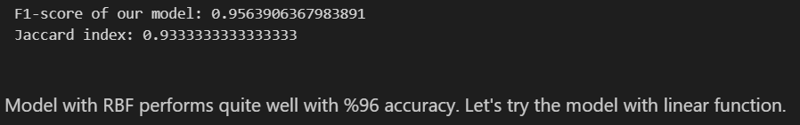
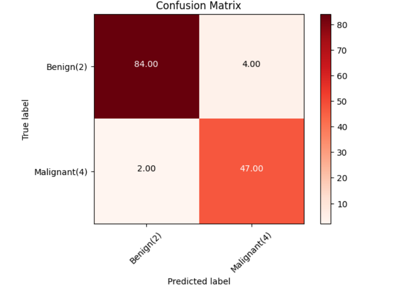

Cancer Cell Classifier – High Accuracy

A Machine Learning–based project for classifying cancerous and non-cancerous cells using
Support Vector Machine (SVM). The model achieves high accuracy and is evaluated using
standard performance metrics.

---

🎯 Motivation
 
Early detection of cancer plays a crucial role in saving lives.  
This project aims to assist in identifying whether a cell is **Benign** or **Malignant**
using Machine Learning techniques on medical data.

---

📁 Dataset Description
 
The dataset contains numerical features extracted from breast cell samples.

 Features:
- Clump Thickness
- Uniformity of Cell Size
- Uniformity of Cell Shape
- Marginal Adhesion
- Single Epithelial Cell Size
- Bare Nuclei
- Bland Chromatin
- Normal Nucleoli
- Mitoses

 Target Class:
- **2 → Benign (Non-Cancerous)**
- **4 → Malignant (Cancerous)**

> The `ID` column is removed during preprocessing as it does not contribute to prediction.

---

 ⚙️ Project Workflow
1. Load CSV dataset
2. Data cleaning and preprocessing
3. Feature scaling using StandardScaler
4. Train-test split
5. Model training using SVM (RBF kernel)
6. Model evaluation and visualization

---

 🤖 Machine Learning Model
 
- **Algorithm:** Support Vector Machine (SVM)
- 
- **Kernel:** RBF (Radial Basis Function)

 Why SVM?
- Performs well on high-dimensional data
- Effective for medical classification tasks
- Handles non-linear decision boundaries efficiently

---

 📊 Results & Evaluation
- **Accuracy:** ~96%
- Performance evaluated using:
  - Accuracy Score
  - Precision, Recall, F1-score
  - Confusion Matrix

📈 Model Performance Visualizations

🔹 Accuracy
The following image shows the achieved accuracy of the model:

---

🔹 Confusion Matrix
The confusion matrix visualizes correct and incorrect predictions:

---

 🛠️ Tech Stack
- Python
- Pandas
- NumPy
- Scikit-learn
- Matplotlib
- Seaborn

---

 🚀 How to Run the Project

1️⃣ Clone the repository

git clone [https://github.com/madhusudanladda/Cancer-Cell-Classifier-High-Acc.git](https://github.com/madhusudanladda/Cancer-Cell-Classifier-High-Acc.git)

cd Cancer-Cell-Classifier-High-Acc

2️⃣ Install dependencies

pip install -r requirements.txt

3️⃣ Run the notebook

Open main.ipynb in Jupyter Notebook or VS Code and execute the cells.

📌 Repository Structure
text
Copy code
├── main.ipynb

├── cancer_cell_dataset.csv

├── requirements.txt

├── accuracy.png

├── confusion_matrix.png

└── README.md

🔮 Future Scope

Deploy the model using Streamlit or Flask

Compare SVM with Random Forest and Neural Networks

Use larger real-world medical datasets

Cloud deployment for remote access

👨‍💻 Author

Madhusudan Ladda

BTech Computer Science

Interested in Machine Learning & Medical AI
